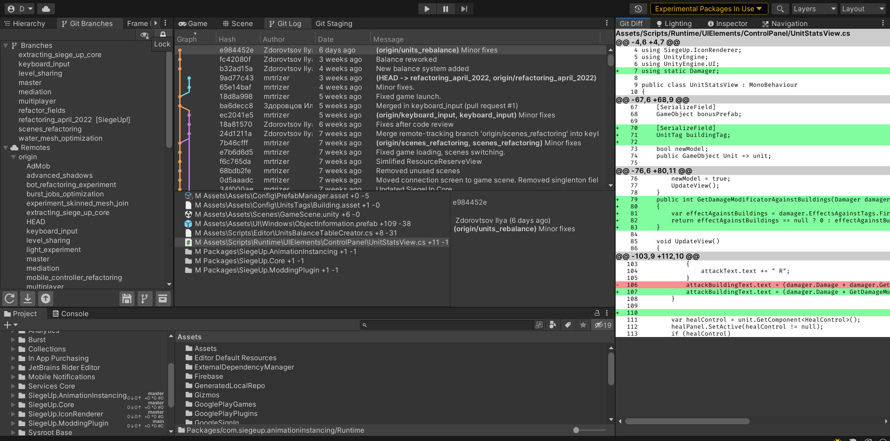
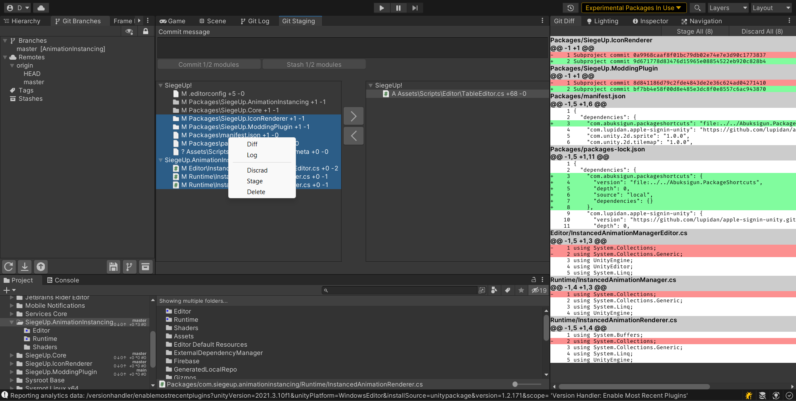

**Use at your own risk, I'm not guranteing it will work correctly for all cases and you won't loose your data 😉**

Main goal is to optimize workflow for both artists and programmers.

It's handy even if you have a single repo and use another GitUI alongside. It's build with performance and extendability in mind. This plugin doesn't use undocumented features. I'm also trying to keep code compact and predictable.

**It requires git to be installed and added to PATH environment varialbe!**

Features:
- Main feature - most of the operations below are available for multiple repos at onece
- Manage Branches, Tags, Stash
- View Log (Work in progress)
- Staging and Commit
- Merge (Take theirs/Take mine)
- View Diff (hunk handling in progress)
- Fetch/Pull/Push
- Remote settings
- Process log showing what exact git commands were performed and their output
- Project Browser extention
    - Displaying current status of repos, current brahch and remote status
    - Displaying status of files and highlight directories with modified files

In development:
- Hunk and managment
- Blame
- Linux and Mac support (Currently they can't detect file changes because I relied on FileSystemWatcher for this)

